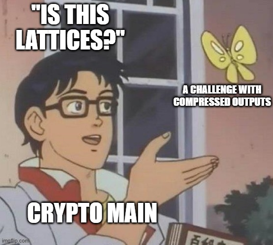

# basic-sums

## Summary

**Challenge description:**

This challenge uses a function to change number bases of integers to encode the flag. However, instead of returning the flag base encoded in the base of our choosing, it returns the sum of the digits. However, this way of compressing and obfuscating the output does not add security and trivial to reverse using basic number theory.

**Artifacts:**

* solve.py: solve script that executes the exploit and recovers the flag
* chal.py: the original challenge implementation
* flag.txt: sample flag for testing purposes

## Context

The challenge gives us a link to stackoverflow provides a handy function that allows you to change the base of any integer. The challenge also provides us with the netcat connection that is running the `chal.py` program. The netcat connection allows us to interact with the program by sending bases and receiving the calculated encoded summs.

Before we go on, let's spend a minute understanding what a base system is. A number $N$ can be represented in any base system $b$ with the general equation

$N = d_1b^{n-1} + d_{2}b^{n-2} + \cdots + d_nb^0$

where $d$ represents each digit from $1$ to $n$, and $b$ represents the power of the base.

In the decimal, or base 10 number system, the number 1337 can be written as $1337 = 1(10^3) + 3(10^2) + 3(10^1) + 7(10^0)$. As you can see, $1$ represents the "thousands place", 3 the "hundreds place", 3 the "tens place" and 7 the "ones place", in the base 10 numbering system. However, in this problem and as shown through the stack overflow implementation, you can convert a number into any base numbering system, not just the common ones like binary (base 2), octal (base 8), decimal (base 10), hexadecimal (base 16), or base64.

This process of changing the base of a number is called *encoding*. It is sometimes used to perform different kinds of operations on data or as a form of obfuscation in code.

This challenge doesn't return the encoded number, however, but returns the sum of the digits, therefore "compressing" the output so that we can't reverse the operation to get the flag. But we have a few more tools in our belt with base number systems that we can use.

We can use well-known divisibility proofs with radices. Take for example the base 10 numbering system. You might know that if the sum of the digits of a base 10 number is divisible by 9, then the number itself is divisible by 9. More generally, we can state that the sum of the digits for number $N$ in base $b$ is congruent to $N \pmod{b-1}$.

We can prove this by looking at $N = d_1b^{n-1} + d_{2}b^{n-2} + \cdots + d_nb^0$ and dividing by $b-1$. $b$ is congruent to $1 \pmod{b-1}$, so any power of $b$ will also be congruent to $1$. Therefore $N \equiv d_1 + d_2 + \cdots + d_n \pmod{b-1}$, which is the same as the sum of the digits.

Now that we have a handy way of relating sums of digits and base number systems, we can use this knowledge to solve for $N$.

## Vulnerability

The vulnerability stems from properties of base number systems and the fact that encoding should not be used for security purposes. As stated above, although the output seems to be obfuscated by sums of digits since brute forcing reversing the output is computationally intractable, we can use several different sums from base systems to solve for the flag with a system of equations.

## Exploitation

**Exploit overview:**

The exploit involves using the Chinese Remainder Theorem to solve for the flag by using the sums of digits for all of the bases.

**Exploit mitigation considerations:**

This exploit could be mitigated by limiting access to the "number to base" function or by including randomized output or padding.

**Exploit description:**

The exploit connects to the challenge instance in a loop, obtaining and storing the sum for each base. Normally for using the CRT method, you must use only moduli that are coprime. However, since we know a solution exists, we can have sage math handle moduli that are not coprime for us. Note that we use the range from 3 to 257 because we are working our equations with $b - 1$, as we saw above that the sum of the digits is equivalent to the flag $\pmod{b-1}$.

Then, with our bases and sums we can now solve our system of equations by sending the sums as our residues and the list of bases $b-1$ as our moduli.

Now we have our solution from using `sage` built in `crt()` function, but we need to brute force the number of bytes in the flag in order to decode. I just did this through guessing and checking until I was able to recover the flag. 45 bytes was a good place to start as it's the upper bound of the flag length in the `chal.py` file.

**Exploit primitives used**:

1. Deobfuscation
2. Base encoding
3. Chinese Remainder Theorem

## Remediation

Encoding should not be relied upon as a security measure. Instead, programs should implement cryptographically secure hashes or encryption algorithms to generate compressed outputs that cannot be reasonably reversed.

## Configuration Notes

The solution script works by launching a local process of the `chal.py` script. `flag.txt` and `chal.py` must be in the same directory for `solve.py` to run properly.

## Additional Notes

Thanks to Ryan who solved this challenge and helped me with the write-up.
